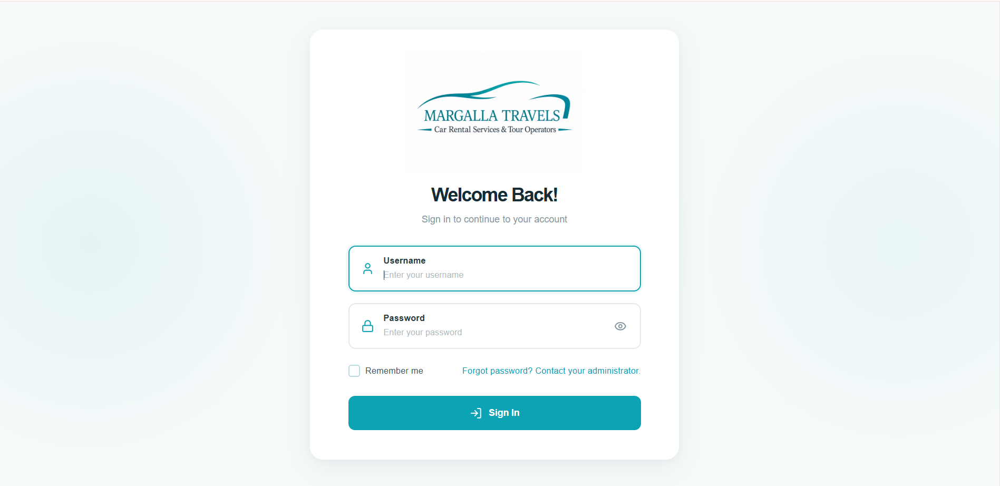
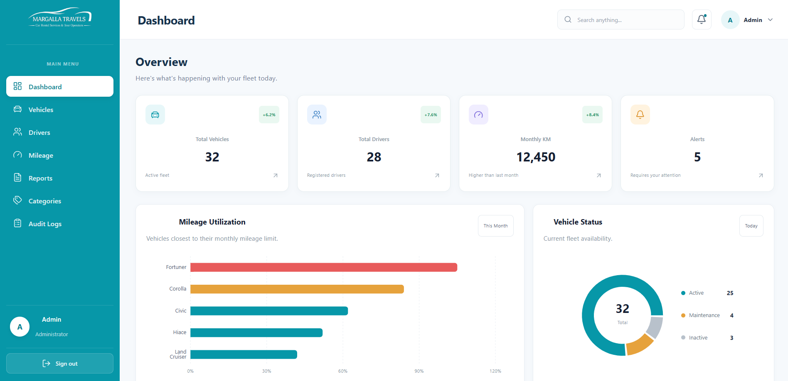
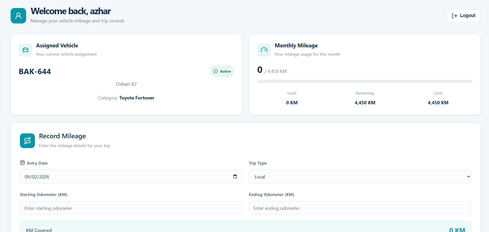
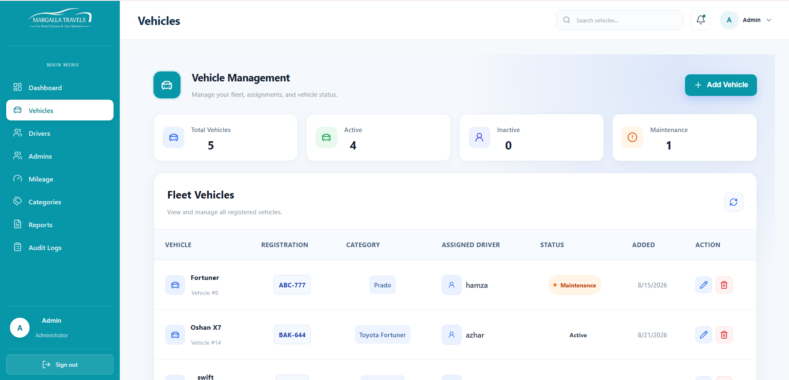
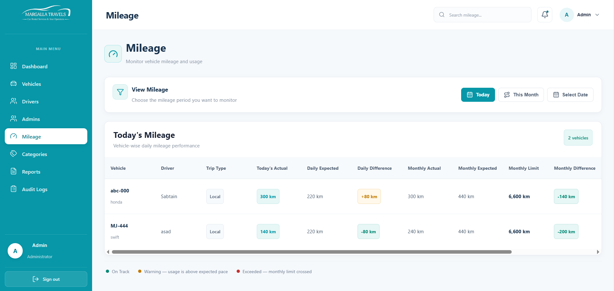
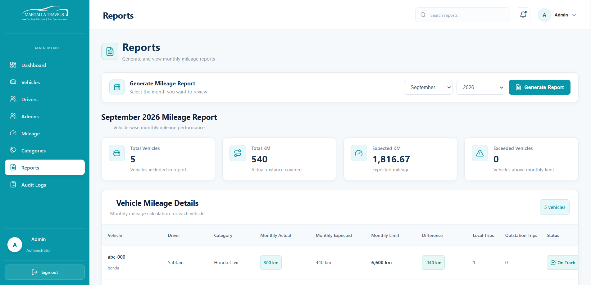

# Margalla Travels Management System

A full-stack fleet and mileage management system designed to help Margalla Travels manage vehicles, drivers, mileage records, vehicle categories, and monthly mileage limits.

The system provides separate functionality for administrators and drivers, allowing administrators to manage the fleet while drivers can securely record and monitor their mileage.

---

## Features

### Administrator Features

* Secure administrator authentication
* Username and password login
* Create and manage administrator accounts
* Create and manage driver accounts
* Add, edit, and delete vehicles
* Assign drivers to vehicles
* Manage vehicle categories
* Configure monthly mileage limits
* Monitor vehicle mileage
* View vehicle and driver information
* View audit logs
* Search and filter management data
* Manage vehicle status
* Responsive dashboard interface

### Driver Features

* Secure driver authentication
* Username and password login
* View assigned vehicle
* View vehicle category and status
* View monthly mileage usage
* View remaining monthly mileage
* Record daily mileage
* Select trip type:

  * Local
  * Outstation
* Automatic KM covered calculation
* View previously submitted mileage records
* Prevention of duplicate mileage submissions
* Password reset functionality
* Temporary password and password reset flow

---

## Technology Stack

### Frontend

* React
* Vite
* React Router
* CSS
* Lucide React

### Backend

* Node.js
* Express.js

### Database and Authentication

* Supabase
* PostgreSQL
* Supabase Authentication

---

## System Architecture

The application follows a client-server architecture.

```text
React Frontend
      |
      | HTTP Requests
      |
      v
Express.js Backend
      |
      | Database Queries
      |
      v
Supabase
      |
      v
PostgreSQL Database
```

### Authentication Flow

```text
User
  |
  v
Login
  |
  v
Supabase Authentication
  |
  v
Access Token
  |
  v
Express Authentication Middleware
  |
  v
Protected API Routes
```

---

## User Roles

The system currently supports two user roles.

### Administrator

Administrators have access to management features including:

* Dashboard
* Vehicle management
* Driver management
* Category management
* Mileage monitoring
* Monthly mileage limits
* Audit logs
* Administrator management

### Driver

Drivers have access to their personal dashboard where they can:

* View their assigned vehicle
* Monitor monthly mileage
* Submit mileage records
* Select trip types
* View mileage history

---

## Database Structure

The application uses the following main tables.

| Table                     | Description                        |
| ------------------------- | ---------------------------------- |
| `profiles`                | Stores user profiles and roles     |
| `drivers`                 | Stores driver information          |
| `vehicles`                | Stores vehicle information         |
| `categories`              | Stores vehicle categories          |
| `category_monthly_limits` | Stores monthly mileage limits      |
| `mileage_entries`         | Stores driver mileage records      |
| `audit_logs`              | Stores important system activities |

---

## Authentication

The application uses Supabase Authentication.

Users authenticate using their assigned credentials.

After successful authentication:

1. Supabase creates an authenticated session.
2. The application receives an access token.
3. The access token is sent with protected API requests.
4. The backend verifies the authenticated user.
5. The user's role determines which resources they can access.

Protected routes should not be accessible without valid authentication.

---

## Mileage Management

Drivers can submit mileage information including:

* Entry date
* Starting odometer
* Ending odometer
* Trip type

The system automatically calculates:

```text
KM Covered = Ending Odometer - Starting Odometer
```

The system includes validations to prevent:

* Missing mileage values
* Ending mileage lower than starting mileage
* Duplicate mileage entries
* Invalid vehicle assignments
* Mileage submission when the assigned vehicle is inactive or under maintenance
* Mileage submission by inactive drivers

---

## Vehicle Management

Administrators can:

* Add vehicles
* Edit vehicles
* Delete vehicles
* Assign drivers
* Assign categories
* Update vehicle status

Supported vehicle statuses include:

* Active
* Inactive
* Maintenance

---

## Driver Management

Administrators can:

* Add drivers
* Assign usernames and passwords
* Assign vehicles
* Activate or deactivate drivers
* Edit driver information
* Reset driver passwords
* Delete driver accounts

Drivers do not need a personal Gmail account to access the system. They use credentials assigned by the administrator.

---

## Mileage Limits

Administrators can configure monthly mileage limits for vehicle categories.

The system tracks:

* Monthly mileage used
* Monthly mileage limit
* Remaining mileage
* Mileage percentage

This helps administrators monitor fleet usage and identify vehicles approaching or exceeding their mileage limits.

---

## Audit Logs

Important administrative activities are recorded through the audit logging system.

Audit logs can be used to track actions such as:

* Vehicle changes
* Driver changes
* Category changes
* Mileage-related activities
* Administrator management activities

This provides better accountability and makes important system activity easier to review.

---

## Security

The application includes several security measures:

* Supabase Authentication
* Access token authentication
* Protected backend API routes
* Role-based access control
* Supabase Row Level Security policies
* Server-side authentication validation
* Driver and administrator authorization checks
* Environment-based secret configuration

Sensitive environment variables are stored in environment configuration files and should never be committed to the repository.

---

## Installation

### Clone the Repository

```bash
git clone <repository-url>
```

### Frontend

Navigate to the frontend directory:

```bash
cd margalla-travels-management-frontend
```

Install dependencies:

```bash
npm install
```

Start the development server:

```bash
npm run dev
```

Create a production build:

```bash
npm run build
```

Preview the production build locally:

```bash
npm run preview
```

---

## Backend

Navigate to the backend directory:

```bash
cd margalla-travels-management-backend
```

Install dependencies:

```bash
npm install
```

Start the development server:

```bash
npm run dev
```

---

## Environment Variables

Environment variables should be configured before running the application.

### Frontend

Create a `.env` file:

```env
VITE_SUPABASE_URL=
VITE_SUPABASE_ANON_KEY=
```

### Backend

Create a `.env` file:

```env
SUPABASE_URL=
SUPABASE_SERVICE_ROLE_KEY=
```

Never commit real credentials, passwords, API keys, or secret keys to the repository.

---

## Screenshots

### Login



### Admin Dashboard



### Driver Dashboard



### Vehicle Management



### Mileage Management



### Reports



---

## Production Deployment

Before deploying the system:

* Verify administrator login
* Verify driver login
* Remove test accounts
* Remove dummy data
* Configure production environment variables
* Verify Supabase security policies
* Verify protected API routes
* Verify role-based authorization
* Run a production frontend build
* Test administrator functionality
* Test driver functionality
* Test mileage submission
* Test vehicle status restrictions
* Test responsive design
* Verify HTTPS is enabled
* Verify production database backups

---

## Project Structure

```text
margalla-travels-management-frontend/
│
├── src/
│   ├── components/
│   ├── pages/
│   ├── context/
│   ├── api/
│   └── ...
│
├── screenshots/
│   ├── login.png
│   ├── adminDashboard.png
│   ├── driverdashboard.png
│   ├── mileage.png
│   ├── report.png
│   └── vehicles.png
│
├── README.md
├── package.json
└── vite.config.js
```

---

## Future Improvements

Possible future improvements include:

* Email notifications
* Advanced reporting
* Vehicle maintenance scheduling
* Driver performance reports
* Export mileage reports
* Advanced analytics
* Real-time notifications
* Mobile application

---

## Author

Developed as a full-stack fleet and mileage management system.

---

## License

This project contains business-specific functionality and data. Redistribution or reuse should only be permitted according to the project owner's requirements.
